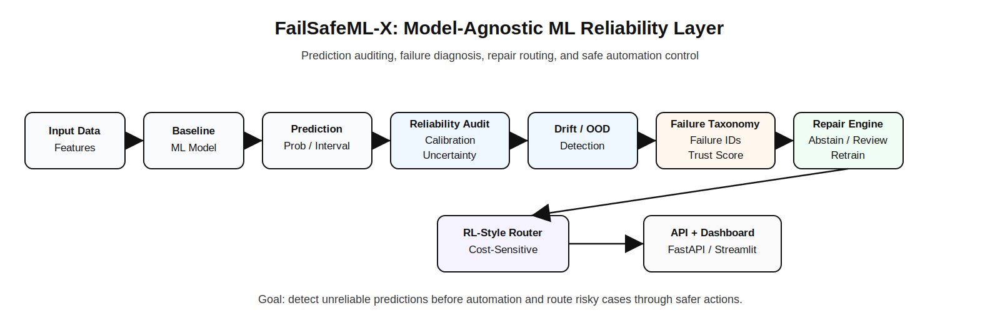

# FailSafeML-X

**Self-Healing Reliability Layer for Real-World Machine Learning Systems**

FailSafeML-X is a research-grade and portfolio-grade AI/ML systems prototype for auditing machine-learning predictions before they are allowed to trigger automated decisions. It is intentionally **not a RAG project**. The project focuses on ML reliability failures such as calibration error, high uncertainty, data drift, out-of-distribution inputs, model decay, unsafe automation, and decision-routing risk.

The system converts a raw model prediction into a structured reliability decision envelope:

```text
prediction → uncertainty → drift/OOD signals → failure taxonomy → trust score → repair plan → router action
```

## Project Status

This repository contains a completed locally verified prototype through Milestone 20.

| Milestone | Component | Status |
|---|---|---|
| M1 | Baseline multi-domain reliability benchmark | Complete |
| M2 | Uncertainty and calibration engine | Complete |
| M3 | Drift and out-of-distribution detection | Complete |
| M4 | Failure taxonomy and trust score | Complete |
| M5 | Repair engine and before/after benchmark | Complete |
| M6 | RL-style repair router | Complete |
| M7 | FastAPI, Streamlit dashboard, and demo layer | Complete |
| M8 | Final packaging, Docker, docs, and project artifacts | Complete |
| M9 | CI/CD and software engineering hardening | Complete |
| M10 | Agentic reliability explanation layer | Complete |
| M11 | Optional Airflow orchestration layer | Complete |
| M12 | PySpark / Databricks-style distributed drift pipeline | Complete |
| M13 | AI security guardrails and human-review safety checks | Complete |
| M14 | Local inference optimization benchmark | Complete |
| M15A | Optional LLM provider abstraction for local/OpenAI-compatible/Bedrock-ready explanations | Complete |
| M15B | Optional RAGOps reliability extension | Complete |
| M15C | Dataset loader and validation layer | Complete |
| M15D | Provider-aware reliability agent integration | Complete |
| M15E | Local experiment registry and model risk card | Complete |
| M16 | Monitoring metrics export and Prometheus/Grafana-ready artifacts | Complete |
| M17 | Terraform and Helm deployment templates | Complete |
| M18 | Managed cloud AI deployment templates | Complete |
| M19 | LoRA / PEFT fine-tuning scaffold | Complete |
| M20 | Final advanced packaging, architecture docs, recruiter walkthrough, and research summary | Complete |

Expected local validation:

```text
all tests pass
M9 completed successfully.
M10 completed successfully.
M18 completed successfully.
M13 completed successfully.
M14 completed successfully.
M15A completed successfully.
M15B completed successfully.
M15C completed successfully.
M15D completed successfully.
M15E completed successfully.
M16 completed successfully.
M19 completed successfully.
```

## Problem

ML systems can fail even when model accuracy looks acceptable. A prediction may be high confidence but poorly calibrated, generated on shifted data, affected by out-of-distribution inputs, or unsafe to automate without human review.

FailSafeML-X treats reliability as a first-class system layer. Instead of only returning a prediction, it produces:

- uncertainty and calibration diagnostics,
- drift and OOD signals,
- explicit failure IDs,
- trust score,
- repair plan,
- routing decision,
- API/dashboard output,
- reproducible benchmark reports.

## Core Research Question

Can a model-agnostic reliability layer reduce unsafe automated ML decisions by detecting reliability failures and routing predictions through targeted repair actions such as abstention, human review, active learning, threshold adjustment, and retrain evaluation?

## Key Contributions

### 1. Multi-Domain Reliability Benchmark

The project uses reproducible synthetic healthcare-style classification and energy-style time-series regression benchmarks.

### 2. Calibration and Conformal Uncertainty

Milestone 2 adds calibration bins, expected calibration error, confidence summaries, conformal prediction sets, and conformal prediction intervals.

### 3. Drift and OOD Detection

Milestone 3 detects feature drift, prediction drift, and distance-based out-of-distribution risk.

### 4. Failure Taxonomy and Trust Score

Milestone 4 maps reliability signals into named failure IDs, severity levels, trust scores, and deployment-routing recommendations.

### 5. Repair Engine

Milestone 5 applies repair actions and reports before/after safety tradeoffs, including unsafe auto-decision rate and automation tradeoff plots.

### 6. RL-Style Repair Router

Milestone 6 compares rule-based routing with a cost-sensitive tabular Q-learning repair router.

### 7. API and Dashboard Demo Layer

Milestone 7 exposes reliability scoring through FastAPI and provides a Streamlit dashboard.

### 8. Final Packaging

Milestone 8 adds Docker support, a release checklist, architecture documentation, demo script, project card, and a preliminary patent-screening note.


### 13. AI Security Guardrails

Milestone 13 adds deterministic local guardrails for prompt-injection detection, secret-like string detection, unsafe tool request blocking, unsafe ML auto-decision blocking, and human-review routing. This is a security validation layer for the prototype, not a formal security certification or production compliance claim.

### 14. Inference Optimization Benchmark

Milestone 14 adds local inference latency, p50/p95, throughput, and mini-batch benchmarking without claiming production GPU serving or guaranteed acceleration.


### Optional Dataset Validation Layer

Milestone 15C adds a lightweight CSV dataset loader and validator so FailSafeML-X can check schema consistency, required columns, numeric fields, missing values, duplicate rows, class imbalance, leakage-like columns, and time-series timestamp ordering before reliability evaluation.

## Architecture

```text
Data + Features
   |
   v
Baseline ML Models
   |
   v
Prediction + Probability / Interval
   |
   +--> Calibration + Conformal Uncertainty
   +--> Drift + OOD Detection
   +--> Failure Taxonomy
   +--> Trust Score
   |
   v
Repair Engine
   |
   +--> Accept
   +--> Abstain
   +--> Human Review
   +--> Active Learning Queue
   +--> Threshold Adjustment
   +--> Retrain Evaluation
   |
   v
RL-Style Router
   |
   v
FastAPI / Streamlit Demo Layer
```



## Agentic Reliability Layer

Milestone 10 adds an optional LangGraph/LangChain-style reliability agent layer with a deterministic local fallback. It explains failure IDs, summarizes trust scores, interprets drift/OOD risk, recommends repair actions, and generates human-review notes without requiring API keys or external LLM calls.

## Optional Airflow Orchestration

Milestone 11 adds an optional Airflow-style DAG for scheduled reliability evaluation. The DAG orchestrates M1 through M10 milestone runners and includes a static validator that does not require Airflow to be installed. This is an orchestration template, not a production Airflow deployment.


### 12. Distributed Drift Pipeline

Milestone 12 adds a PySpark-compatible distributed drift analysis module with a deterministic Pandas/NumPy fallback. It reports mean shift, standard-deviation shift, PSI-style drift scores, top drifted features, and severity labels for large-batch monitoring. The repository includes Databricks-style workflow documentation but does not claim a live Databricks deployment.

## Engineering and CI/CD

FailSafeML-X includes a lightweight software engineering validation layer and optional PySpark-compatible drift analysis:

- GitHub Actions CI for tests, packaging validation, and Docker build validation
- local CI runner through `scripts/local_ci.py`
- project-structure validation through `scripts/validate_project_structure.py`
- pytest coverage for reliability modules and repository structure
- reproducible ML pipeline checks through milestone runners

## Optional LLM Provider Abstraction

Milestone 15A adds an optional provider layer for reliability explanations. The default provider is a deterministic local fallback, so tests and local CI require no API keys and make no external LLM calls. OpenAI-compatible and AWS Bedrock Converse-style adapters are present but disabled by default.

Safe claim: optional provider abstraction implemented. Do not claim AWS Bedrock production usage or OpenAI production usage unless credentials are configured and the external path is actually run.


## Optional RAGOps Reliability Extension

Milestone 15B adds a local-first RAGOps reliability extension. It loads markdown documents, chunks them, retrieves context with a deterministic local retriever, checks citation coverage, detects stale or conflicting evidence, flags prompt-injection-like content inside retrieved context, identifies untrusted sources, assigns RAG failure IDs, and recommends RAG repair actions.

This extension is optional and CI-safe. It does not require OpenAI, AWS Bedrock, Pinecone, Weaviate, Qdrant, Chroma, FAISS, or live internet access.

## Provider-Aware Reliability Agent

Milestone 15D connects the deterministic reliability agent to the optional provider abstraction. The default path remains local/offline and requires no API keys. OpenAI-compatible and AWS Bedrock-style adapters are available as opt-in provider targets but are disabled by default and are not called during tests or local CI.

Safe claim: provider-aware reliability explanations are integrated with local fallback. Do not claim live OpenAI or AWS Bedrock usage unless the external path is intentionally configured and executed.


## Experiment Registry and Model Risk Card

Milestone 15E adds a local JSON experiment registry plus generated model card and model-risk card artifacts. It records dataset validation status, reliability failure counts, repair action counts, trust-score summaries, provider safety settings, artifact paths, and best-effort git metadata. This is a lightweight MLflow/DVC-style tracking layer, not a live MLflow server, DVC remote, or compliance certification.


## LoRA / PEFT Fine-Tuning Scaffold

Milestone 19 adds a safe fine-tuning scaffold for reliability explanations. It generates instruction-style JSONL records from FailSafeML-X failure IDs, repair actions, trust scores, RAGOps failures, dataset-validation warnings, and provider-safety events. It also includes a LoRA/PEFT configuration template and a non-executing training stub.

This is intentionally CI-safe: no model is fine-tuned, no model is downloaded, no GPU is required, no adapter weights are created, and no external API calls are performed during tests.

Safe claim: fine-tuning scaffold and instruction-data builder implemented. Do not claim a fine-tuned model exists unless actual training is performed and evaluated.

## Technology Stack

| Area | Tools |
|---|---|
| ML baselines | scikit-learn, Random Forest, Gradient Boosting, Logistic Regression |
| Reliability | calibration metrics, conformal prediction, drift detection, OOD scoring |
| Repair logic | rule-based repair engine, abstention, human review, active learning, threshold adjustment |
| RL routing | tabular Q-learning style router, rule baseline |
| API | FastAPI, Uvicorn |
| Dashboard | Streamlit |
| Reporting | JSON, Markdown, Matplotlib figures |
| Packaging | Dockerfile, Docker Compose, Makefile |
| Testing | Pytest |
| Orchestration | optional Airflow DAG template, static DAG validation |

## Repository Structure

```text
failsafeml-x/
  apps/
    streamlit_dashboard.py
  configs/
  docs/
    architecture.md
    demo_script.md
    github_release_checklist.md
    patent_screening_memo.md
    airflow_orchestration.md
  infra/
    airflow/
      dags/
        failsafeml_nightly_reliability_dag.py
  scripts/
    run_m1_baseline.py
    run_m2_uncertainty_calibration.py
    run_m3_drift_ood.py
    run_m4_failure_taxonomy.py
    run_m5_repair_engine.py
    run_m6_rl_router.py
    run_m7_api_dashboard_demo.py
    run_m8_final_packaging.py
    run_m9_cicd_software_quality.py
    run_m10_agentic_reliability.py
    run_m11_airflow_orchestration.py
  src/failsafemlx/
    data/
    evaluation/
    features/
    models/
    packaging/
    reliability/
    reporting/
    serving/
    utils/
  tests/
  Dockerfile
  docker-compose.yml
  Makefile
```

## Quick Start

### 1. Create environment

```bash
python3 -m venv .venv
source .venv/bin/activate
python -m pip install --upgrade pip
pip install -r requirements.txt
```

### 2. Run tests

```bash
python -m pytest
```

Expected:

```text
all tests pass
```

### 3. Run all milestones

```bash
python scripts/run_m1_baseline.py
python scripts/run_m2_uncertainty_calibration.py
python scripts/run_m3_drift_ood.py
python scripts/run_m4_failure_taxonomy.py
python scripts/run_m5_repair_engine.py
python scripts/run_m6_rl_router.py
python scripts/run_m7_api_dashboard_demo.py
python scripts/run_m8_final_packaging.py
python scripts/run_m9_cicd_software_quality.py
python scripts/run_m10_agentic_reliability.py
python scripts/run_m11_airflow_orchestration.py
python scripts/run_m12_spark_drift_pipeline.py
python scripts/run_m13_ai_security.py
python scripts/run_m14_inference_optimization.py
python scripts/run_m15a_provider_abstraction.py
python scripts/run_m15b_ragops_reliability.py
python scripts/run_m15c_dataset_validation.py
python scripts/run_m15d_provider_agent_integration.py
python scripts/run_m15e_experiment_registry.py
python scripts/run_m16_monitoring_metrics.py
python scripts/run_m17_infra_templates.py
python scripts/run_m18_cloud_ai_templates.py
```

Expected final line:

```text
M18 completed successfully.
```

## Run API

```bash
uvicorn failsafemlx.serving.fastapi_app:app --app-dir src --reload --port 8000
```

Open:

```text
http://127.0.0.1:8000/docs
```

## Run Dashboard

```bash
PYTHONPATH=src streamlit run apps/streamlit_dashboard.py
```

## Docker

Build and run API:

```bash
docker build -t failsafemlx-api:local .
docker run -p 8000:8000 failsafemlx-api:local
```

Or use Docker Compose:

```bash
docker compose up --build
```

API:

```text
http://127.0.0.1:8000/docs
```

Dashboard:

```text
http://127.0.0.1:8501
```

## API Endpoints

| Endpoint | Purpose |
|---|---|
| `GET /health` | Service health and project metadata |
| `POST /reliability/score` | Score one prediction reliability request |
| `POST /reliability/batch` | Score a demo batch and return summary statistics |

## Generated Artifacts

| Artifact | Purpose |
|---|---|
| `experiments/results/m1_baseline_metrics.json` | Baseline metrics |
| `experiments/results/m2_uncertainty_calibration.json` | Calibration and conformal uncertainty results |
| `experiments/results/m3_drift_ood.json` | Drift and OOD results |
| `experiments/results/m4_failure_taxonomy_trust_score.json` | Failure taxonomy and trust scoring results |
| `experiments/results/m5_repair_engine_before_after.json` | Repair before/after benchmark |
| `experiments/results/m6_rl_repair_router.json` | RL router benchmark |
| `experiments/results/m7_api_dashboard_demo.json` | API/dashboard demo summary |
| `experiments/results/m8_final_packaging.json` | Final release packaging summary |
| `experiments/results/m9_cicd_software_quality.json` | CI/CD and software quality validation |
| `experiments/results/m10_agentic_reliability.json` | Agentic reliability explanation validation |
| `experiments/results/m11_airflow_orchestration.json` | Optional Airflow orchestration validation |
| `reports/milestone_*.md` | Reproducible milestone reports |
| `reports/figures/*.png` | Generated plots |
| `reports/final_project_card.md` | Portfolio project card |
| `experiments/results/m17_infra_templates.json` | Terraform/Helm template validation summary |
| `reports/milestone_17_infra_templates.md` | Deployment template validation report |
| `experiments/results/m18_cloud_ai_templates.json` | Managed cloud AI template validation summary |
| `reports/milestone_18_cloud_ai_templates.md` | Managed cloud AI template report |


## Honest Limitations

This is a research and portfolio prototype, not a production-certified safety system.

Current limitations:

- Synthetic benchmarks only.
- No real hospital, grid, finance, or enterprise dataset is included.
- Repair policies are deterministic/simulated and require real-world validation.
- RL routing is tabular and prototype-level, not a deep RL production policy.
- API/dashboard are local demo layers, not hardened cloud deployments.
- Security, authentication, persistence, live production monitoring, and production orchestration hardening are future work.
- Patentability is not claimed.

## Future Work

Planned extensions:

- Evaluate on public real-world datasets.
- Add MLflow experiment tracking and DVC data versioning.
- Add live Prometheus/Grafana deployment beyond local monitoring artifacts.
- Execute and harden Kubernetes/Terraform/Helm deployments in a real cluster.
- Add deeper RL or contextual bandit routing.
- Add LLM-generated reliability explanations with strict guardrails.
- Add human-labeled validation and statistical significance testing.

## Research and Patent Note

FailSafeML-X does not claim novelty over uncertainty estimation, conformal prediction, drift detection, human-in-the-loop ML, MLOps monitoring, or reinforcement learning individually.

The potentially interesting direction is the integrated decision envelope that combines calibrated uncertainty, drift/OOD risk, explicit failure taxonomy, repair-plan generation, and cost-sensitive routing for model-agnostic reliability operations.

Patentability is not claimed. The repository includes a preliminary, non-legal patent-screening memo only.


### Monitoring Metrics Export

Milestone 16 exports local Prometheus text-format reliability metrics and a Grafana dashboard JSON skeleton. It tracks unsafe auto-decision rate, average trust score, drift/OOD warnings, human-review rate, repair-action counts, dataset validation errors, RAG reliability failures, and provider-safety status. This is monitoring-ready packaging, not a claim of live production Prometheus/Grafana deployment.


### Deployment Templates

Milestone 17 adds static Terraform and Helm templates for packaging the FailSafeML-X FastAPI reliability service. The templates include safe local/offline provider defaults, health probes, optional Prometheus scrape annotations, and Kubernetes service packaging. This is template validation only: no Terraform execution, Helm installation, Kubernetes cluster, cloud credentials, or production deployment is claimed.


### Managed Cloud AI Templates

Milestone 18 adds CI-safe AWS SageMaker and Google Vertex AI style inference templates. The templates show how a managed inference handler can wrap model outputs with a FailSafeML-X reliability envelope, including trust score, failure IDs, repair actions, routing decisions, and provider-safety metadata.

This is template validation only: no SageMaker endpoint, Vertex AI endpoint, model upload, cloud SDK, cloud credential, or live deployment is required or claimed.


## Final Advanced Packaging

Milestone 20 completes the advanced packaging layer. It adds a final architecture document, recruiter walkthrough, research summary, advanced project card, final validation script, and an advanced architecture SVG.

FailSafeML-X remains a **locally validated prototype**, not a production-certified platform. The default path requires **no external API**, no paid provider calls, no AWS credentials, no GPU, no external vector database, and no live cloud deployment.

Final safe positioning: FailSafeML-X is a model-agnostic ML reliability platform prototype with calibration, conformal uncertainty, drift/OOD detection, failure taxonomy, repair routing, optional RAGOps reliability auditing, provider-aware explanations, dataset validation, model-risk documentation, monitoring-ready metrics, deployment templates, managed-cloud inference templates, and a LoRA/PEFT fine-tuning scaffold.
