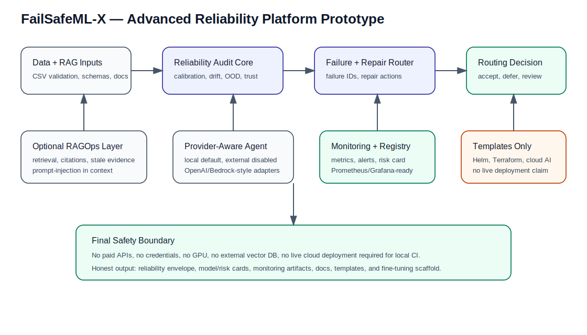

# FailSafeML-X

**Self-Healing Reliability Layer for Real-World Machine Learning Systems**

FailSafeML-X is a model-agnostic ML reliability platform prototype that audits model predictions before they are allowed to trigger automated decisions.

Most ML projects stop at accuracy, F1, AUROC, or RMSE. FailSafeML-X focuses on what happens after a model produces a prediction: whether the output is reliable, whether the input looks shifted or out-of-distribution, whether the model is calibrated, and whether the system should accept, defer, repair, or route the case to human review.

This project is locally validated through **M20** with:

```text
157 passing tests
Local CI checks passed
No paid APIs required
No cloud credentials required
No GPU required
```

---

## What the system does

FailSafeML-X wraps a model output inside a reliability decision pipeline:

```text
Model Prediction
   ↓
Uncertainty + Calibration Check
   ↓
Drift / OOD Detection
   ↓
Failure Taxonomy
   ↓
Trust Score
   ↓
Repair Recommendation
   ↓
Routing Decision
```

Instead of returning only a prediction, the system produces a structured reliability envelope with:

- uncertainty and calibration diagnostics
- drift and out-of-distribution signals
- named failure IDs
- trust score
- recommended repair action
- human-review or abstention routing
- API-ready output
- monitoring-ready metrics
- reproducible reports

---

## Why this matters

A model can perform well in a notebook and still fail in deployment.

Common real-world issues include data drift, model overconfidence, low-confidence predictions, out-of-distribution inputs, calibration decay, and unsafe automated decisions.

FailSafeML-X treats reliability as a system layer between the model and the decision.

> A model should not be trusted automatically just because it produced a prediction.

---

## Key capabilities

| Area | What is implemented |
|---|---|
| Reliability evaluation | Calibration, uncertainty, conformal prediction, drift, and OOD checks |
| Failure taxonomy | Named ML failure IDs with severity and explanations |
| Repair routing | Abstain, human review, active learning, threshold adjustment, and retrain evaluation |
| Agentic explanations | Local provider-aware reliability explanations with no API key required |
| RAGOps extension | Local-first checks for stale, unsafe, missing-citation, and conflicting retrieved context |
| Dataset validation | CSV loading, schema checks, missing values, duplicates, imbalance, leakage-like columns, and timestamp ordering |
| Experiment tracking | Local JSON experiment registry, model card, and model risk card |
| Monitoring | Prometheus-style metrics and Grafana dashboard skeleton |
| Security | Prompt-injection, unsafe tool request, secret-like string, and unsafe auto-decision checks |
| Deployment templates | Docker, Terraform, Helm, SageMaker-style, and Vertex AI-style templates |
| Fine-tuning scaffold | LoRA/PEFT dataset builder and training stub without model downloads or GPU requirements |

---

## Milestone summary

| Milestone | Component | Status |
|---|---|---|
| M1 | Baseline reliability benchmark | Complete |
| M2 | Uncertainty and calibration engine | Complete |
| M3 | Drift and OOD detection | Complete |
| M4 | Failure taxonomy and trust score | Complete |
| M5 | Repair engine and before/after benchmark | Complete |
| M6 | RL-style repair router | Complete |
| M7 | FastAPI + Streamlit demo layer | Complete |
| M8 | Packaging, Docker, docs, and project card | Complete |
| M9 | CI/CD and software quality hardening | Complete |
| M10 | Agentic reliability layer | Complete |
| M11 | Airflow-style orchestration template | Complete |
| M12 | PySpark / Databricks-style drift pipeline | Complete |
| M13 | AI security and guardrails | Complete |
| M14 | Inference optimization benchmark | Complete |
| M15A | Optional LLM provider abstraction | Complete |
| M15B | Optional RAGOps reliability extension | Complete |
| M15C | Dataset loader and validator | Complete |
| M15D | Provider-aware reliability agent | Complete |
| M15E | Experiment registry and model risk card | Complete |
| M16 | Monitoring metrics export | Complete |
| M17 | Terraform + Helm templates | Complete |
| M18 | Managed cloud AI templates | Complete |
| M19 | LoRA / PEFT fine-tuning scaffold | Complete |
| M20 | Final advanced packaging | Complete |

---

## Architecture

```text
Data / Input
   ↓
Baseline Model
   ↓
Prediction + Probability / Interval
   ↓
Reliability Audit
   ├── Calibration check
   ├── Conformal uncertainty
   ├── Drift detection
   ├── OOD detection
   ├── Dataset validation
   ├── RAGOps reliability checks
   └── Security guardrails
   ↓
Failure Taxonomy + Trust Score
   ↓
Repair Engine
   ├── Accept
   ├── Abstain
   ├── Human review
   ├── Active learning
   ├── Threshold adjustment
   └── Retrain evaluation
   ↓
API / Dashboard / Reports / Monitoring
```



---

## Quick start

Create a virtual environment:

```bash
python3 -m venv .venv
source .venv/bin/activate

python -m pip install --upgrade pip
pip install -r requirements.txt
```

Run tests:

```bash
python -m pytest
```

Run full local CI:

```bash
python scripts/local_ci.py
```

Expected result:

```text
157 passed
Local CI checks passed.
```

---

## Run selected milestones

```bash
python scripts/run_m8_final_packaging.py
python scripts/run_m15b_ragops_reliability.py
python scripts/run_m15c_dataset_validation.py
python scripts/run_m16_monitoring_metrics.py
python scripts/run_m20_final_advanced_packaging.py
```

---

## Run the API

```bash
uvicorn failsafemlx.serving.fastapi_app:app --app-dir src --reload --port 8000
```

Open:

```text
http://127.0.0.1:8000/docs
```

---

## Run the dashboard

```bash
PYTHONPATH=src streamlit run apps/streamlit_dashboard.py
```

---

## Repository structure

```text
failsafeml-x/
  apps/                    Streamlit dashboard
  charts/                  Helm chart template
  cloud/                   SageMaker / Vertex AI style templates
  data/                    Sample datasets, schemas, RAGOps docs, fine-tuning JSONL
  docs/                    Architecture, walkthroughs, deployment notes, research summary
  experiments/results/     Milestone JSON outputs
  infra/                   Airflow and Terraform templates
  monitoring/              Prometheus and Grafana-ready artifacts
  reports/                 Milestone reports, model card, risk card, figures
  scripts/                 Milestone runners and local CI
  security/                AI security checklist
  src/failsafemlx/         Main package
  tests/                   Pytest suite
```

---

## Important honest limitations

This repository is a locally validated prototype. It does **not** claim:

- production certification
- live cloud deployment
- live AWS Bedrock or OpenAI production usage
- live Kubernetes deployment
- live MLflow/DVC server operation
- a trained or deployed fine-tuned LLM
- medical, financial, or legal decision approval
- formal security compliance certification

External providers, vector databases, cloud services, Airflow, Spark, Terraform, Helm, and LoRA/PEFT training are implemented as safe optional templates or scaffolds unless explicitly configured and executed.

---

## Recruiter summary

FailSafeML-X demonstrates applied ML engineering, reliability engineering, MLOps, RAGOps, AI safety, monitoring, deployment design, and research-style documentation in one end-to-end project.

It shows how a model output can be wrapped with reliability checks, failure diagnosis, trust scoring, repair routing, monitoring metrics, and human-review controls before the system allows an automated decision.
