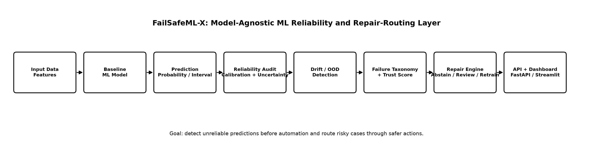
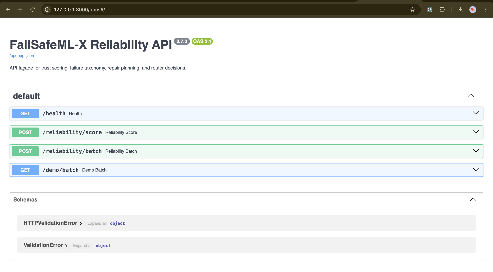
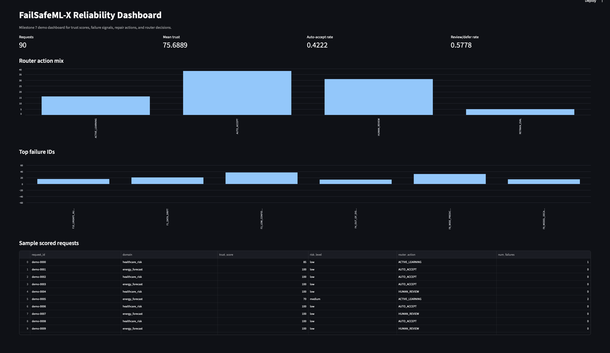

# FailSafeML-X

FailSafeML-X is an ML reliability prototype I built to explore a simple but important question:

> What should happen when a machine learning model produces a prediction, but the system is not confident enough to trust it automatically?

Most ML projects stop at accuracy, F1 score, AUROC, RMSE, or a similar model metric. This project looks at what happens after a model produces a prediction. It checks whether the prediction is reliable, whether the input looks different from the training data, whether the model is poorly calibrated, and whether the decision should be accepted, deferred, routed to human review, or used for retraining.

This is not a RAG project or a chatbot. It is a model-agnostic reliability layer for ML systems.

---

## Overview

FailSafeML-X wraps a model prediction inside a reliability decision pipeline:

```text
data -> model -> prediction -> reliability audit -> failure diagnosis -> repair action -> routing decision
```

Instead of returning only a class label or regression output, the system produces a structured decision envelope with:

- uncertainty and calibration diagnostics
- drift and out-of-distribution signals
- explicit failure IDs
- trust score
- recommended repair action
- routing decision
- API-ready output
- dashboard visualization
- reproducible benchmark reports

The goal is not to make a model magically safe. The goal is to make risky automated decisions easier to detect, explain, and route through safer paths.

---

## Why this project matters

A model can perform well on a benchmark and still fail in deployment.

Some common real-world failure cases include:

- incoming data no longer matches the training distribution
- the model is overconfident
- prediction confidence is too low
- the input is out-of-distribution
- calibration has degraded
- the model should not be allowed to make an automated decision

FailSafeML-X treats reliability as a system layer between a model and an automated decision.

The central idea is simple:

> A model should not always be allowed to act just because it produced a prediction.

---

## What I built

### 1. Multi-domain reliability benchmark

The project starts with two reproducible benchmark problems:

- healthcare-style binary risk classification
- energy-style time-series regression

The datasets are synthetic by design, so the full pipeline can be shared and reproduced without exposing private, regulated, or proprietary data.

---

### 2. Calibration and uncertainty engine

The system measures whether model confidence is trustworthy using:

- expected calibration error
- Brier score
- calibration bins
- confidence summaries
- conformal prediction sets
- conformal prediction intervals

This helps identify cases where the model may appear confident but is not actually reliable enough for automation.

---

### 3. Drift and OOD detection

The reliability layer checks whether new inputs still resemble the training or calibration data using:

- feature drift detection
- prediction drift checks
- distance-based out-of-distribution scoring

These signals help identify when the model is being asked to make predictions under conditions it may not have learned well.

---

### 4. Failure taxonomy

Detected reliability problems are mapped into named failure IDs.

Examples:

```text
F1_DATA_DRIFT
F2_MODEL_OVERCONFIDENCE
F3_LOW_CONFIDENCE_PREDICTION
F4_OUT_OF_DISTRIBUTION_INPUT
F5_LABEL_NOISE_SUSPECTED
F6_CLASS_IMBALANCE_FAILURE
F7_CALIBRATION_FAILURE
F8_WIDE_PREDICTION_INTERVAL
F9_MODEL_DECAY_OVER_TIME
F10_UNSAFE_AUTO_DECISION
```

This makes the system easier to debug because reliability issues are named explicitly instead of being hidden inside raw metrics.

---

### 5. Repair engine

The system recommends repair actions when reliability risks are detected.

Examples:

```text
R1_RECALIBRATE_MODEL
R2_APPLY_CONFORMAL_PREDICTION
R3_ABSTAIN_FROM_AUTO_DECISION
R4_ROUTE_TO_HUMAN_REVIEW
R5_TRIGGER_ACTIVE_LEARNING
R6_RETRAIN_WITH_REVIEWED_SAMPLES
R7_SWITCH_TO_BACKUP_MODEL
R8_FLAG_DATA_PIPELINE_DRIFT
R9_ADJUST_DECISION_THRESHOLD
R10_REQUEST_MORE_FEATURES
```

The repair engine focuses on safer routing decisions such as abstention, review, active learning, and threshold adjustment.

---

### 6. RL-style repair router

FailSafeML-X includes a small tabular Q-learning repair router. The router compares possible repair actions using a cost-sensitive reward function that considers trust, severity, review cost, automation risk, and unsafe decisions.

This is included as a research prototype to explore how reliability-aware repair policies could be selected automatically.

---

### 7. API and dashboard layer

The project includes:

- FastAPI app for reliability scoring
- Streamlit dashboard for demo visualization
- Docker-ready packaging
- reproducible milestone scripts
- pytest validation suite
- generated reports and figures

---

## Architecture

```text
Data + Features
   |
   v
Baseline ML Models
   |
   v
Prediction
   |
   +--> Calibration Check
   +--> Conformal Uncertainty
   +--> Drift Detection
   +--> OOD Detection
   |
   v
Failure Taxonomy + Trust Score
   |
   v
Repair Engine
   |
   +--> Accept
   +--> Abstain
   +--> Human Review
   +--> Active Learning Queue
   +--> Threshold Adjustment
   +--> Retrain Evaluation
   |
   v
RL-Style Repair Router
   |
   v
FastAPI / Streamlit Demo Layer
```



---

## Milestones

| Milestone | Component | Status |
|---|---|---|
| M1 | Baseline multi-domain reliability benchmark | Complete |
| M2 | Uncertainty and calibration engine | Complete |
| M3 | Drift and out-of-distribution detection | Complete |
| M4 | Failure taxonomy and trust score | Complete |
| M5 | Repair engine and before/after benchmark | Complete |
| M6 | RL-style repair router | Complete |
| M7 | FastAPI, Streamlit dashboard, and demo layer | Complete |
| M8 | Final packaging, Docker, docs, and reports | Complete |

---

## Local validation

Final local validation:

```text
47 passed
M8 completed successfully
```

FastAPI loaded successfully with the following routes:

```text
/health
/reliability/score
/reliability/batch
/demo/batch
/docs
```

---

## Demo screenshots

FastAPI documentation:



Streamlit reliability dashboard:



---

## Quick start

Clone the repository:

```bash
git clone https://github.com/anirudh2272/failsafeml-x.git
cd failsafeml-x
```

Create and activate a virtual environment:

```bash
python3 -m venv .venv
source .venv/bin/activate
```

Install dependencies:

```bash
python -m pip install --upgrade pip
pip install -r requirements.txt
```

Run tests:

```bash
python -m pytest
```

---

## Run the full milestone pipeline

```bash
python scripts/run_m1_baseline.py
python scripts/run_m2_uncertainty_calibration.py
python scripts/run_m3_drift_ood.py
python scripts/run_m4_failure_taxonomy.py
python scripts/run_m5_repair_engine.py
python scripts/run_m6_rl_router.py
python scripts/run_m7_api_dashboard_demo.py
python scripts/run_m8_final_packaging.py
```

---

## Run the API

```bash
PYTHONPATH=src python -m uvicorn failsafemlx.serving.fastapi_app:app --reload --port 8000
```

Open:

```text
http://127.0.0.1:8000/docs
```

---

## Run the dashboard

```bash
PYTHONPATH=src python -m streamlit run apps/streamlit_dashboard.py
```

Open:

```text
http://localhost:8501
```

---

## Repository structure

```text
failsafeml-x/
├── apps/                  # Streamlit dashboard
├── assets/                # Screenshots and project assets
├── configs/               # Dataset and experiment configs
├── docs/                  # Architecture, demo, release notes
├── experiments/results/   # JSON outputs from milestone runs
├── reports/               # Milestone reports and project card
├── reports/figures/       # Generated plots
├── scripts/               # Reproducible milestone runners
├── src/failsafemlx/       # Main package
├── tests/                 # Pytest validation suite
├── Dockerfile
├── docker-compose.yml
├── Makefile
└── README.md
```

---

## Key outputs

The project generates milestone reports and figures, including:

- baseline classification and regression metrics
- calibration diagnostics
- conformal uncertainty reports
- drift and OOD summaries
- failure taxonomy reports
- trust score visualizations
- repair engine before/after results
- RL router action summaries
- final project card

Important report files:

```text
reports/final_project_card.md
reports/milestone_1_baseline.md
reports/milestone_2_uncertainty_calibration.md
reports/milestone_3_drift_ood.md
reports/milestone_4_failure_taxonomy_trust_score.md
reports/milestone_5_repair_engine_before_after.md
reports/milestone_6_rl_repair_router.md
reports/milestone_7_api_dashboard_demo.md
reports/milestone_8_final_packaging.md
```

---

## Limitations

FailSafeML-X is a research and portfolio prototype. It is not a production-certified safety system, medical device, financial decision engine, or compliance product.

The current version uses synthetic benchmark data so the system can be shared publicly and reproduced easily. Real-world deployment would require domain-specific validation, monitoring, governance, and human-in-the-loop review design.

---

## Current status

FailSafeML-X is complete through Milestone 8 and ready for GitHub review, portfolio use, and further extension.
